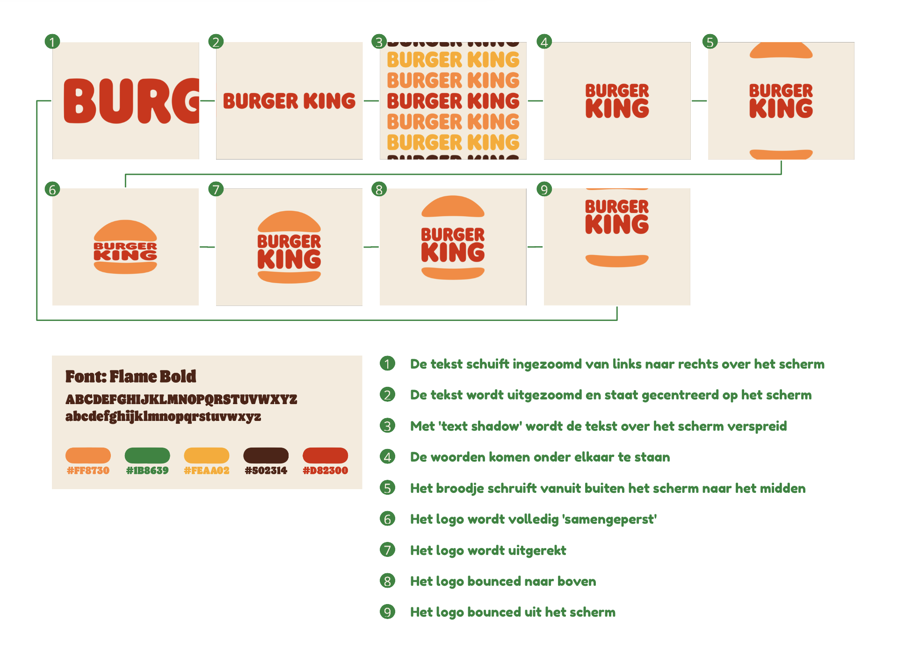
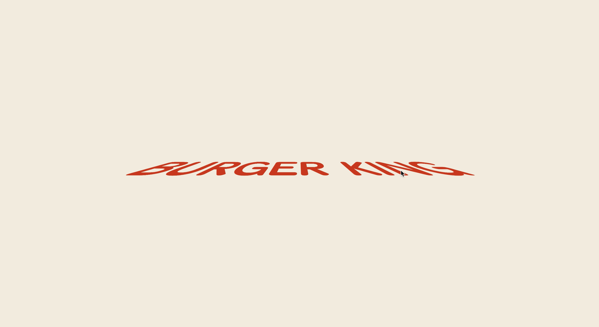
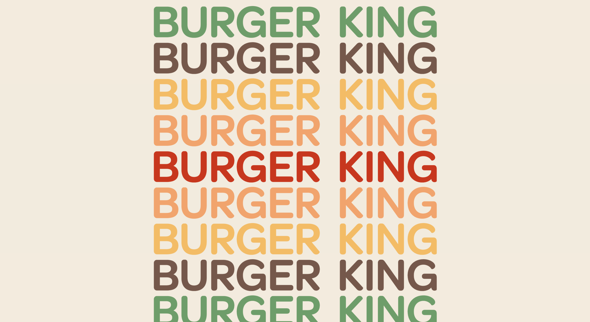
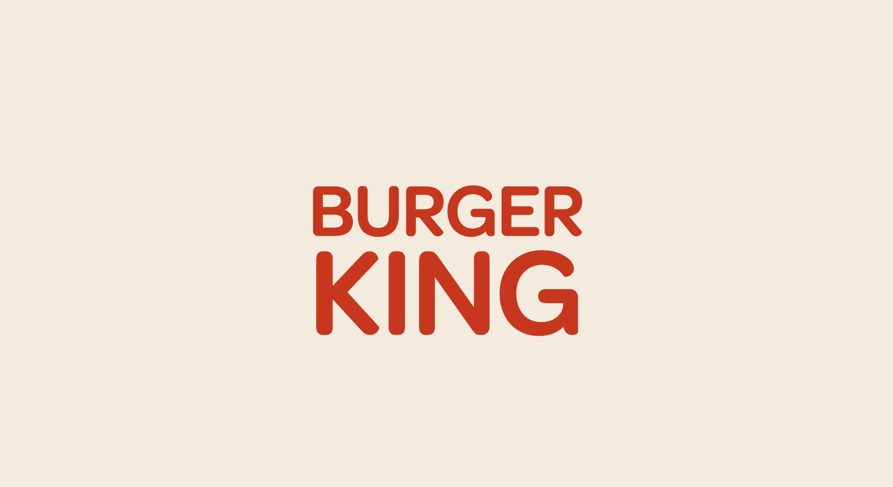
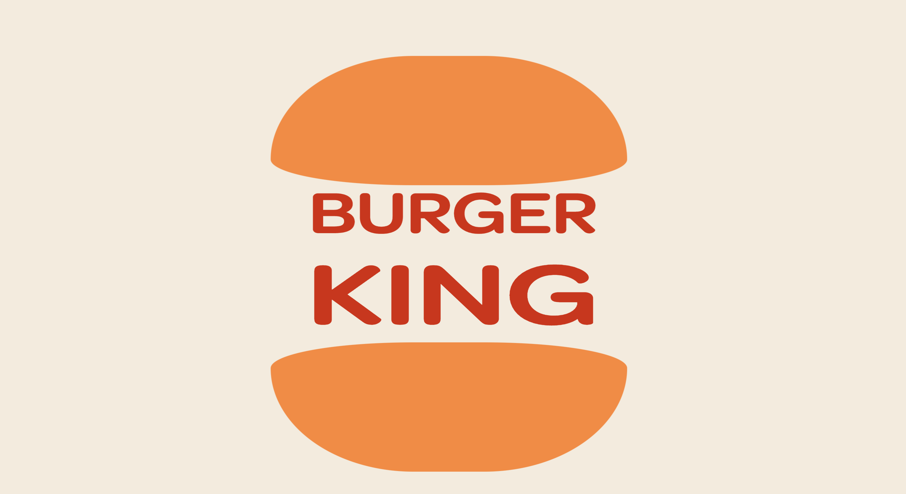
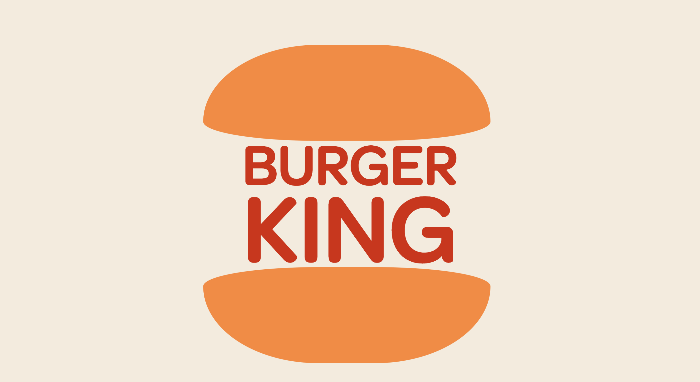
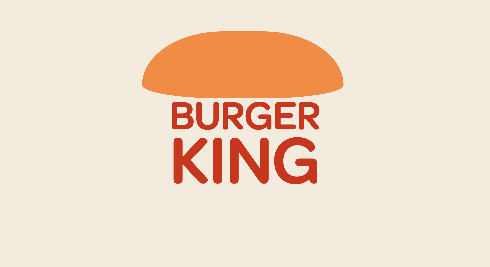
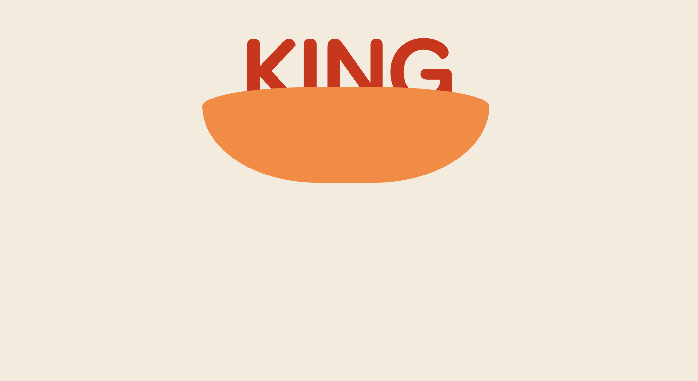
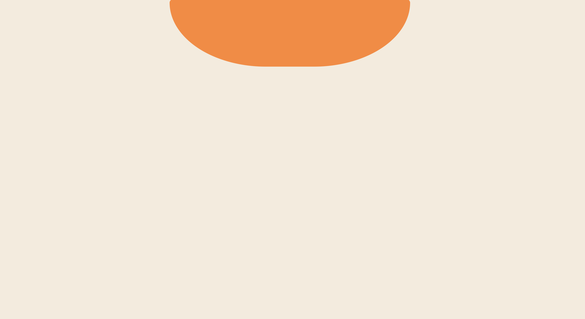
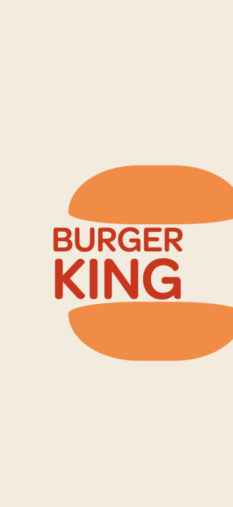

# Procesverslag
**Auteur:** Larissa Hartsteen

**De opdrachten:** [opdracht 1](opdracht1/index.html) en [opdracht 2](opdracht2/index.html)

Markdown is een simpele manier om HTML te schrijven.  
Markdown cheat cheet: [Hulp bij het schrijven van Markdown](https://github.com/adam-p/markdown-here/wiki/Markdown-Cheatsheet).

Nb. De standaardstructuur en de spartaanse opmaak van de README.md zijn helemaal prima. Het gaat om de inhoud van je procesverslag. Besteedt de tijd voor pracht en praal aan je website.

Nb. Door *open* toe te voegen aan een *details* element kun je deze standaard open zetten. Fijn om dat steeds voor de relevante stuk(ken) te doen.

## Bronnenlijst
  1. http://thenewcode.com/1137/MinMaxing-Understanding-vMin-and-vMax-in-CSS
  2. https://9elements.github.io/fancy-border-radius/
  3. https://developer.mozilla.org/en-US/docs/Web/CSS/text-shadow
  4. https://codepen.io/Mashbu01/pen/VmLVQR

## Opdracht 1 plan

  
uitwerken na schetsen idee (voor week 2)

  ### Je storyboard:
  

  ### Je ambitie: 
  Aan deze technieken/punten wil ik werken:
  - Ik wil leren hoe ik het logo 'samen kan persen'
  - Ik wil leren hoe ik met de tekst onder elkaar kan zetten, in verschillende kleuren
  - Ik wil proberen de burger met css vorm te geven
  - Ik wil dat de animatie er vloeiend uit komt te zien
 

## Opdracht 1 reflectie

  
uitwerken bij afronden opdracht (voor week 3)

  ### Je uitkomst - karakteristiek screenshot(s):
  
  
  
  
  
  
  
  
  

  ### Dit ging goed/Heb ik geleerd: 
- Ik heb geleerd hoe ik met textshadows een tekst/woorden onder elkaar kan zetten, met hun verschillende kleuren

- Ik heb geleerd hoe je met border-radius een vorm met alleen css kan maken en animeren

- Ik heb geleerd hoe ik meerdere animaties op één element kan zetten en laten afspelen
<!--  -->

- Ik heb geleerd hoe ik met transform elementen kan verplaatsen

- Ik heb geleerd hoe je met vmin en vmax elementen responsive kan maken

  ### Dit was lastig/Is niet gelukt:
- Ik vond het lastig om bij de laatste stap de burger en tekst vloeiend uit beeld te laten gaan

- Het is mij niet gelukt om de eerste stap van mijn storyboard te maken, daarom heb ik deze uiteindelijk toch veranderd

- Doordat ik nog wat aanpassingen heb gemaakt aan het einde kreeg ik het niet meer voor elkaar om de burger gecentreerd op beeld te krijgen

## Opdracht 2 plan

  
uitwerken na schetsen idee (voor week 4)

  ### Je ontwerp:
  

  ### Je ambitie: 
  Aan deze technieken/punten wil ik werken:
  - punt 1
  - punt 2
  - nog een punt
  - ...

## Opdracht 2 test

  
uitwerken na testen (week 6/7)

  Neem minimaal 5 bevindingen op:

  ### Bevinding 1:
  Omschrijving van wat er nog niet orde was (tekst en afbeeding(en)).

  #### oplossing:
  Beschrijving hoe je het hebt hebt opgelost of als het niet gelukt is hoe je het zou oplossen (tekst en afbeeding(en)).

  ### Bevinding 2:
  Omschrijving van wat er nog niet orde was (tekst en afbeeding(en)).

  #### oplossing:
  Beschrijving hoe je het hebt hebt opgelost of als het niet gelukt is hoe je het zou oplossen (tekst en afbeeding(en)).

  ### Bevinding 3:
  ...

## Opdracht 2 reflectie

  
uitwerken bij afronden opdracht (voor week 8)

  ### Je uitkomst - karakteristiek screenshot(s):
  

  ### Dit ging goed/Heb ik geleerd: 
  Korte omschrijving met plaatje(s)

  

  ### Dit was lastig/Is niet gelukt:
  Korte omschrijving met plaatje(s)

  

